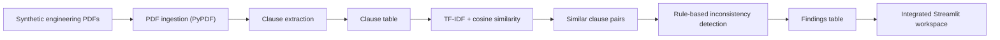

# Engineering Document Consistency AI

## PT-BR

Projeto em Python para reproduzir, de forma pública e ética, uma solução de governança documental aplicada a documentos de engenharia. A ideia central é:

- ler documentos em PDF com formatos distintos;
- extrair cláusulas numeradas;
- encontrar cláusulas semanticamente parecidas entre documentos;
- detectar inconsistências de prazo, responsabilidade, critério de medição e padrão técnico;
- oferecer uma camada de revisão humana em dashboard;
- permitir consultas e navegação dos documentos em um único `Streamlit`.

### Para que serve

Este projeto serve para apoiar equipes que precisam comparar documentos de engenharia e identificar conflitos antes que eles virem retrabalho, atraso ou erro operacional. Na prática, ele ajuda a:

- localizar divergências entre memoriais, anexos e diretrizes;
- comparar cláusulas parecidas sem leitura manual documento por documento;
- priorizar revisão humana em conflitos de prazo, responsabilidade e padrão técnico;
- centralizar consulta e validação em uma interface única.

### O que foi reproduzido

Este case foi inspirado em soluções corporativas de:

- ingestão documental em estilo `Databricks`;
- extração estruturada de cláusulas;
- busca semântica em documentos;
- análise de inconsistência entre memoriais, anexos e instruções técnicas;
- revisão humana antes de uma decisão final.

Para evitar qualquer risco de plágio ou exposição indevida:

- os nomes originais do produto não são usados;
- os documentos do projeto são sintéticos;
- o conteúdo foi reescrito para um cenário público de engenharia.

### Dados usados

Esta versão usa **PDFs sintéticos gerados automaticamente** com cláusulas de engenharia propositalmente conflitantes, por exemplo:

- prazo de entrega `10` vs `15` dias;
- verificação feita pela `contractor` vs `client`;
- medição baseada em `isometric sheets` vs `bill of quantities`;
- padrão técnico `ENG-VAL-01` vs `ENG-VAL-02`.

Isso permite validar a lógica de detecção de inconsistência com total reprodutibilidade.

### Arquitetura



### Técnicas usadas

- geração automática de documentos em PDF com `reportlab`
- parsing de PDF com `pypdf`
- extração de cláusulas numeradas via `regex`
- indexação lexical com `TF-IDF`
- similaridade por cosseno para recuperar cláusulas comparáveis
- detecção de inconsistências por assinatura semântica simples:
  - responsabilidade
  - prazo
  - critério de medição
  - padrão técnico

### Bibliotecas e frameworks

- `reportlab`
  Para gerar os PDFs de exemplo.
- `pypdf`
  Para leitura do texto dos PDFs.
- `pandas`
  Para organizar cláusulas, pares e inconsistências.
- `scikit-learn`
  Para `TfidfVectorizer` e `cosine_similarity`.
- `streamlit`
  Para o dashboard de revisão.
- `plotly`
  Para visualização simples das contagens por tipo de inconsistência.

### Hub integrado no Streamlit

O aplicativo foi organizado como uma experiência única para o usuário final, com módulos dentro do mesmo front:

- `Ingestão`
  Resumo dos documentos processados.
- `Cláusulas`
  Visualização e filtro das cláusulas extraídas.
- `Busca Semântica`
  Pesquisa por trechos semanticamente semelhantes.
- `Consistência`
  Lista dos conflitos detectados e seus tipos.
- `Revisão Humana`
  Aprovação, rejeição ou marcação para análise.
- `Pergunte aos Documentos`
  Camada de consulta assistida baseada nas cláusulas e inconsistências.

### Interface


### Estrutura

- [main.py](/Users/flaviagaia/Documents/CV_FLAVIA_CODEX/engineering-document-consistency-ai/main.py)
- [app.py](/Users/flaviagaia/Documents/CV_FLAVIA_CODEX/engineering-document-consistency-ai/app.py)
- [src/generate_documents.py](/Users/flaviagaia/Documents/CV_FLAVIA_CODEX/engineering-document-consistency-ai/src/generate_documents.py)
- [src/extract_clauses.py](/Users/flaviagaia/Documents/CV_FLAVIA_CODEX/engineering-document-consistency-ai/src/extract_clauses.py)
- [src/consistency_analysis.py](/Users/flaviagaia/Documents/CV_FLAVIA_CODEX/engineering-document-consistency-ai/src/consistency_analysis.py)
- [src/pipeline.py](/Users/flaviagaia/Documents/CV_FLAVIA_CODEX/engineering-document-consistency-ai/src/pipeline.py)

### Como executar

```bash
python3 -m venv .venv
source .venv/bin/activate
pip install -r requirements.txt
python3 main.py
streamlit run app.py
```

### Próxima evolução possível

Uma próxima versão pública pode adicionar:

- `LangChain` para justificar inconsistências em linguagem natural;
- structured output com schema;
- workflow `Human-in-the-Loop`;
- indexação vetorial em `OpenSearch` ou `FAISS`;
- documentos públicos reais além da base sintética.

---

## EN

Python project designed to publicly and ethically reproduce an engineering document governance workflow. The core flow is:

- ingest PDF documents with different formats;
- extract numbered clauses;
- find semantically similar clauses across documents;
- detect conflicts in deadlines, responsibilities, measurement rules, and technical standards;
- provide a human review layer through a dashboard;
- expose all modules through a single `Streamlit` workspace.

### What it is for

This project is meant to support teams that need to compare engineering documents and identify conflicts before they become rework, delays, or operational errors. In practice, it helps users:

- locate divergences across memorials, appendices, and technical guidelines;
- compare similar clauses without manual page-by-page review;
- prioritize human validation on deadline, responsibility, and standard conflicts;
- centralize consultation and validation in a single interface.

### What was reproduced

This case is inspired by enterprise solutions for:

- Databricks-style document ingestion;
- structured clause extraction;
- semantic search over engineering documents;
- cross-document inconsistency analysis;
- human review before a final operational decision.

To avoid plagiarism or disclosure issues:

- original product names were removed;
- this project uses synthetic documents;
- the content was rewritten into a public engineering scenario.

### Data

This version uses **synthetic PDFs generated automatically** with intentionally conflicting engineering clauses, such as:

- delivery deadline `10` vs `15` days;
- verification performed by `contractor` vs `client`;
- measurement based on `isometric sheets` vs `bill of quantities`;
- technical standard `ENG-VAL-01` vs `ENG-VAL-02`.

### Architecture


### Techniques

- automatic PDF generation with `reportlab`
- PDF parsing with `pypdf`
- numbered clause extraction with `regex`
- lexical indexing with `TF-IDF`
- cosine similarity for clause retrieval
- signature-based inconsistency detection over:
  - responsibility
  - deadlines
  - measurement basis
  - technical standard

### Libraries and frameworks

- `reportlab`
- `pypdf`
- `pandas`
- `scikit-learn`
- `streamlit`
- `plotly`

### Integrated Streamlit workspace

The application was designed as a single user-facing workspace with multiple modules:

- `Ingestion`
- `Clauses`
- `Semantic Search`
- `Consistency`
- `Human Review`
- `Ask the Documents`

### Interface


